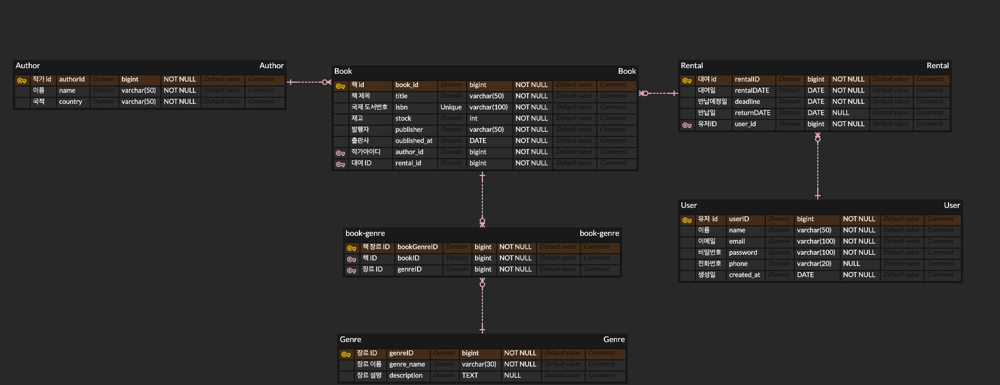

# 📚 책책책 책좀 읽읍시다! 프로젝트

> **도서 대여 통합 관리 시스템**  
> 사용자는 도서를 조회하고 대여 및 반납할 수 있으며, 관리자는 도서를 관리할 수 있는 웹 기반 도서 시스템입니다.
> Spring Boot와 JPA 기반으로 구현되었으며, Thymeleaf를 통해 SSR을 지원합니다.

---

## 📆 프로젝트 기간
- **진행 기간**: 2025.04.13 ~ 진행중
- **참여 인원**: 개인 프로젝트
- **회원 기능**: 2025.04.13 ~ 2025.04.15
---

## 🗂 주요 기능 목록

| 구분 | 설명 |
|------|------|
| 🔐 회원 기능 | 회원가입, 로그인/로그아웃, 아이디/비밀번호 찾기, 마이페이지, 회원정보 수정, 회원탈퇴 |
| 📖 도서 관리 기능 | (예정) 도서 목록 조회, 검색, 상세보기, 등록, 삭제 |
| 🧾 도서 대여 기능 | (예정) 도서 대여, 반납, 대여 이력 확인, 예약 대기 |

---

## 📐 ERD 설계

> **도서, 회원, 대여, 장르, 저자** 관계 중심의 설계

---

## ⚙ 사용 기술 스택

| 구분 | 기술                                     |
|------|----------------------------------------|
| **Language** | Java 17                                |
| **Framework** | Spring Boot 3.4.4 |
| **Template Engine** | Thymeleaf                              |
| **Database** | MySQL                                  |
| **Build Tool** | Gradle                                 |
| **Session** | HttpSession 기반 인증 처리                   |
| **IDE** | IntelliJ IDEA                          |
| **기타** | HTML5, CSS3, GitHub, Markdown   |

---

## 📑 문서 링크

- [회원 기능 명세서](book/docs/User_docs.md)
- [도서 서비스 명세서](book/docs/BookService_docs.md) ← (작성 예정)
- [대여 기능 명세서](book/docs/RentalService_docs.md) ← (작성 예정)

---

## 📌 이후 개발 계획

- ✅ 회원 기능 개발 완료
- ✅ 도서 관리 기능 개발 완료
- ✅ 대여/반납 기능 구현 완료
- ✅ 로그인 유지 및 관리자 페이지 추가
- ✅ 관리자 기능 구현 개발 완료
- 🛠️ 도서 반납 기한 연장 기능 구현 (예정)
- 🛠️ 코드 리팩토링 (예정)
- 🛠️ 배포 (예정)

---

## 🧑‍💻 프로젝트 소개 및 목표

- 자바/Spring Boot 기반의 실전형 CRUD 프로젝트
- 실제 업무 흐름(회원 가입 → 로그인 → 도서 대여 → 반납)의 흐름을 완성
- **RESTful URI 설계, DTO 분리, 세션 관리** 등을 학습하고 적용함

---

## 🙋🏻‍♂️Contact

- GitHub: [goodjunseon](https://github.com/goodjunseon)
- Email: pzs2001926@gmail.com

---
