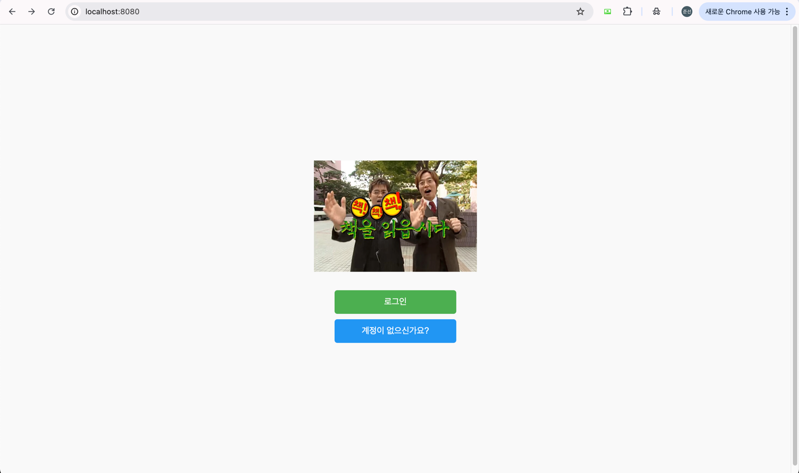
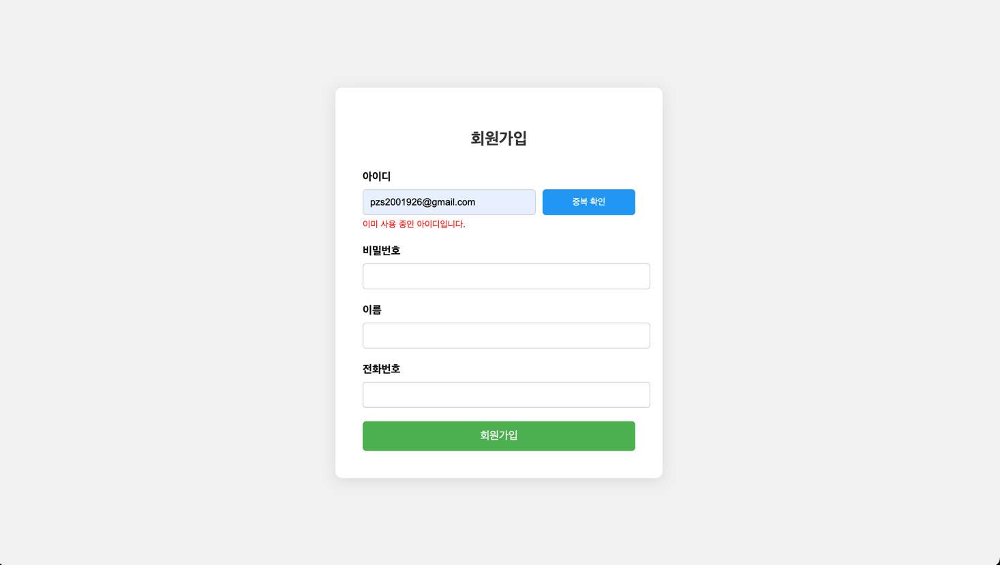
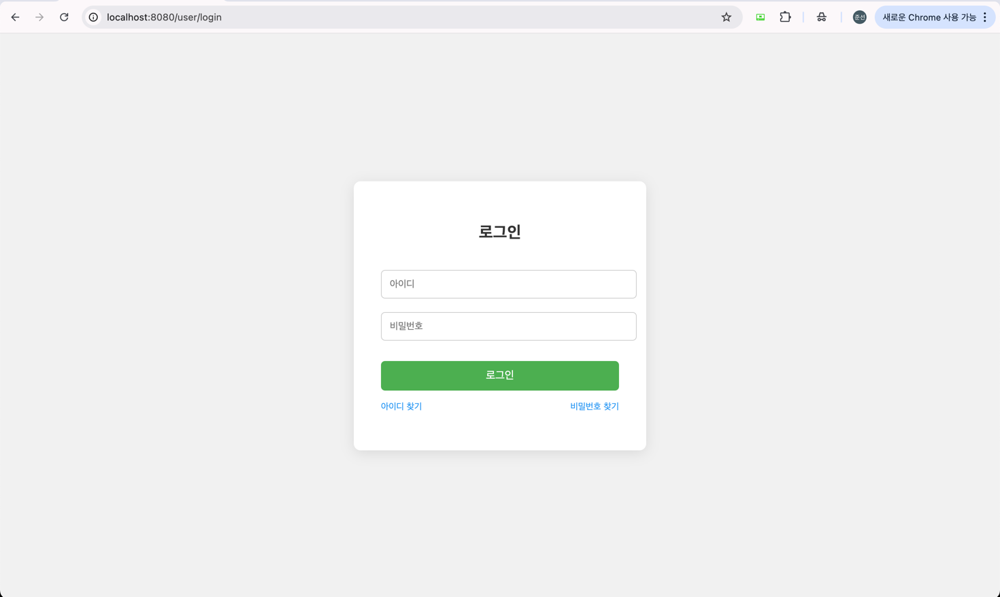
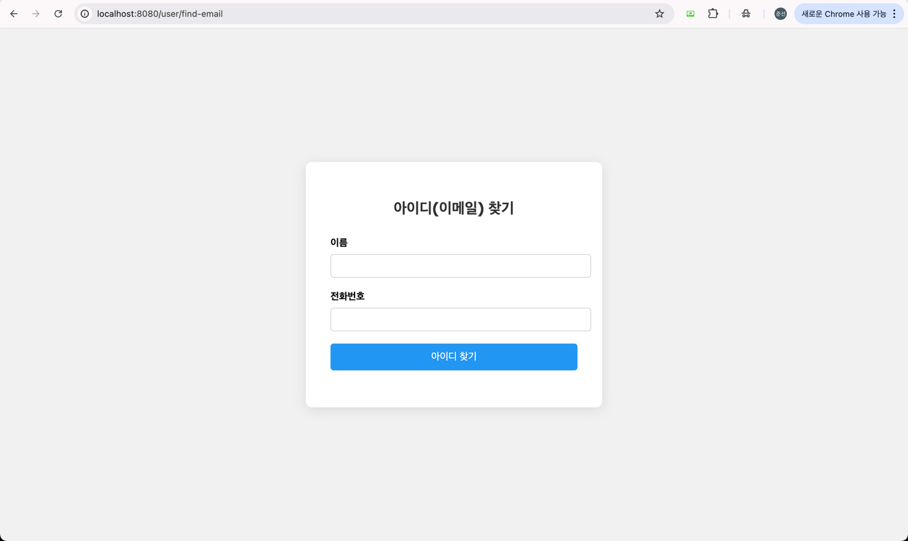
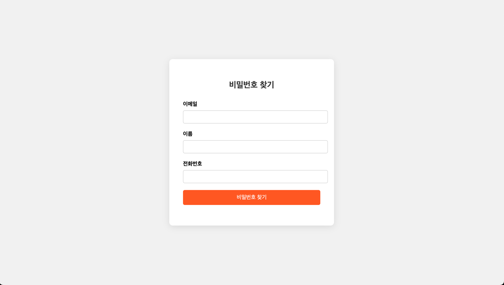
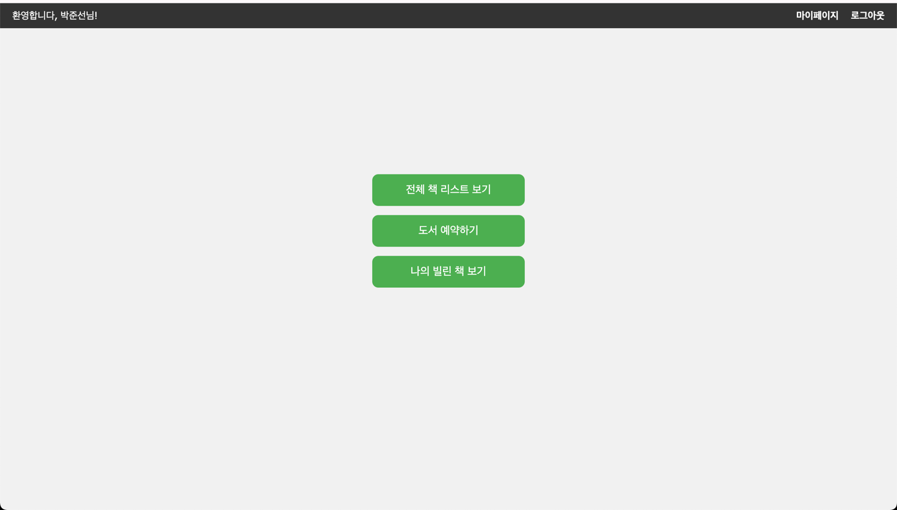
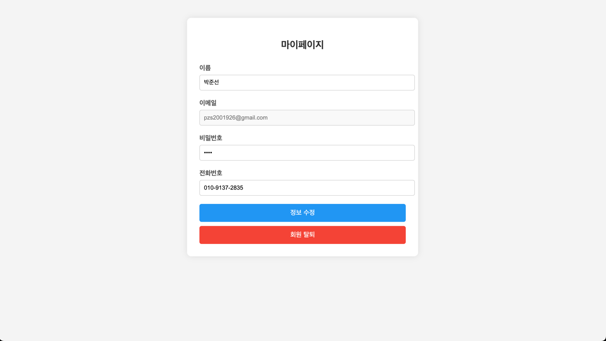

# 📚 책! 책! 책! 책을 읽읍시다!! -회원 관리

**책책책 책을 읽읍시다**는 Spring Boot 기반 도서 대여 웹 서비스입니다.
이 문서는 해당 서비스의 회원 관리 기능에 대한 전체 구조 및 동작 흐름을 정리한 문서입니다.

---

## 1️⃣ 첫 페이지

---

## 회원 기능 목록
## 🔐 회원 가입
- URL: [GET] /user/save, [POST] /user/save
- 입력 항목: 이름, 이메일, 비밀번호, 전화번호
- 이메일 중복 확인: [GET] /user/check-id?email=... (Ajax 사용)
- 유효성 검증 및 오류 메시지 표시 지원

- ---

## 🔓 로그인 / 로그아웃 기능
- 로그인: [GET] /login, [POST] /user/login
- 성공 시 session.setAttribute("loginUser", user)로 사용자 세션 유지
- 실패 시 이메일/비밀번호 오류 메시지 출력
- 로그아웃: [GET] /user/logout
- 세션 무효화 처리

--- 

## 📧 아이디(이메일) 찾기

- URL: [GET] /user/findEmail, [POST] /user/findEmail

- 입력: 이름 + 전화번호

- 출력: 이메일 (존재 시)

- DTO: UserFindEmailDTO(name, phone)

---

## 🔐 비밀번호 찾기

- URL: [GET] /user/findPassword, POST /user/findPassword
- 입력: 이름 + 이메일
- 출력: 비밀번호 (존재 시)
- DTO: UserFindPasswordDTO(name, email)

---
## 🗑️ 회원 탈퇴

- URL: [POST] /user/{userId}/delete
- 조건: 로그인한 사용자와 일치할 경우만 가능
- 처리: 사용자 정보 DB에서 삭제
- 세션 무효화 → 로그아웃 처리

---

## 👤 마이페이지

- URL: [GET] /user/{userId}/myPage, [POST] /user/{userId}/myPage
- 기능: 
  - 사용자 정보 열람 (이메일 readonly / 이름, 비밀번호, 전화번호 required)
  - 이름/비밀번호/전화번호 수정 가능
- DTO를 통해 캡슐화된 정보 전달 (UserMyPageDTO, UserUpdateDTO)
- 수정 시 세션 정보도 동기화 반영

---

